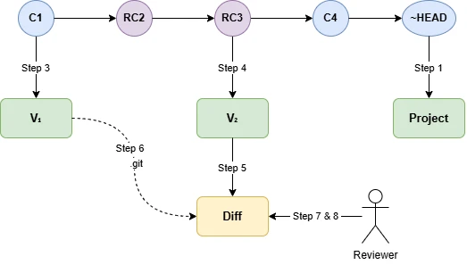
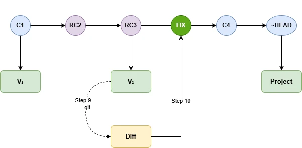

# Visual Code Review Using Studio Pro

This blog describes the manual process. 
Sprint in this repo can maks these steps a simpler.

## Overview

Reviewing commits from your team members is harder than it should be. Looking at the commit history only shows which documents changed — never *what* actually changed inside them. With this guide you can pick any commit, or a series of commits, and do your review directly in Studio Pro.

This guide walks you through reviewing changes between two Mendix commits by using a `diff` folder technique — combining files from one commit with the git history of another so Studio Pro can surface the delta.

* * *

## How it works

The trick is to make Studio Pro believe your project is in an older state, so it presents all the newer changes as uncommitted local modifications — which you can then browse, inspect, and fix using Studio Pro's built-in diff tools.

Say you want to review commits **RC2** and **RC3**, and your project is already ahead. You need two reference points: **C1**, the commit just before your range (the "before" state), and **RC3**, the last commit in your range (the "after" state). You check out each into its own folder.

The `diff` folder is where the review happens. It contains the files from **RC3** — the end result of all the changes — but its `.git` history folder is replaced with the one from **C1**. From git's perspective, the project is still at **C1**. But the actual files on disk already reflect **RC3**. Studio Pro sees that gap and surfaces every difference as a local modification, giving you a clean, visual review of everything that changed across your commit range.



* * *

## Prerequisites

- Mendix Studio Pro 10 (using Git).
    
- Have <ins>git command line</ins> installed.
    
- <ins>Mendix Personal Access Token (PAT)</ins> for the[Team Server](https://docs.mendix.com/developerportal/repository/team-server/) with `mx:modelrepository:repo:read` rights.
    
- Gather the commit hashes you want to review. These can be individual commits or a subsequential range. Take the short commit hash from Studio Pro History dialog, or the full hash from <ins>https://sprintr.home.mendix.com</ins> > Project > Repository > Teamserver.
    

* * *

## Setup

### Step 1 — Check out the project

If you do not already have a local copy, open Mendix Studio Pro and check out your project using the GUI. Referred in the step below as &lt;Project Folder Studio Pro&gt;

> ⚠️ **Git command-line checkout does not work with Mendix projects.** Always use Studio Pro.

### Step 2 — Create the folder structure, copy project

Create a review root folder named after your project, copy the content of the &lt;Project Folder Studio Pro&gt; into the each of the three subfolders. (Note: you do not need to copy the deployment folder.)

```
/<ProjectFolderStudioPro> /
<ProjectName-Review>/ 
 ├── v1_old/
 ├── v2_newer/ 
 └── diff/
```

* * *

## Point Each Folder to the Right Commit

### Step 3 — Reset `v1_old` to the earlier commit

The earlier commit is the commit before the commit you would like to review (**C1** in the picture)

Open a terminal, navigate to `v1_old`, and run:

```
git reset --hard <earlier-commit-hash>
# Example: git reset --hard e69e38ef
```

If you are not yet authenticated, git will popup a dialog. Authenticate yourself with; Username: &lt;MendixAccountEmail&gt; and Password:&lt;PAT&gt;

### Step 4 — Reset `v2_newer` to the later commit

The later commit, included the last change you would like to review (**RC3** in the picture).

Navigate to `v2_newer` and run:

```
git reset --hard <later-commit-hash> 
# Example: git reset --hard dd17c15d
```

### Step 5 — Reset `diff` to the later commit

The commit is the same commit as step 4 (**RC3** in the picture).

Navigate to `diff` and run:

```
git reset --hard <later-commit-hash>
# Example: git reset --hard dd17c15d
```
* * *

## Set Up the Diff Folder

### Step 6 — Swap the `.git` folder

1.  Delete the hidden `.git` folder inside `diff`.
    
2.  Copy the `.git` folder from `v1_old` into `diff`.
    

> **Why?** The `diff` folder now contains **v2's files** but **v1's git history**. When Studio Pro opens it, it will show all the differences between the two commits as local modifications — exactly what you want to review.

* * *

## Review in Studio Pro

### Step 7 — Open the diff folder in Studio Pro

Open the `diff` folder as your project in Studio Pro. You will see all changes between v1 and v2 presented as local modifications.

### Step 8 — Make fixes during review

Work through the changes and apply any corrections directly in Studio Pro, changing the project in the `diff` folder.

> ⚠️ **Do NOT commit at this stage.** When you are done reviewing and fixing, close Studio Pro.

* * *

## Commit Your Changes

Before we can commit the review changes as a fix, we need to make sure we commit it at the right place in history.



### Step 9 — Swap the `.git` folder back

1.  Delete the `.git` folder from `diff`.
    
2.  Copy the `.git` folder from `v2_newer` into `diff`.
    

### Step 10 — Review your fixes and commit

Open the project in the `diff` folder in Studio Pro again. You will now see only your review fixes on top of the v2 baseline. Review them, then commit, and rebase them if necessary.

* * *

## Enjoy your happy code reviews!
